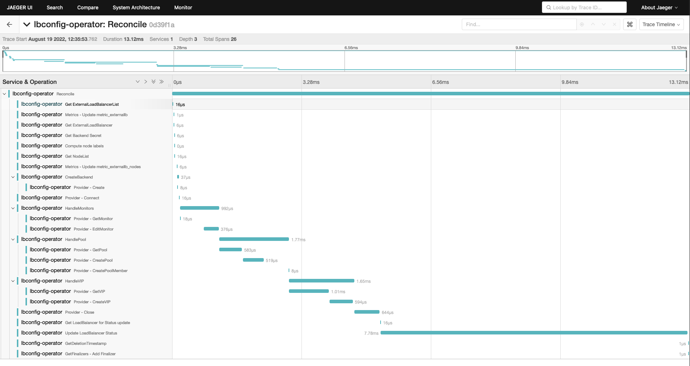

# Tracing

The operator supports tracing using OpenTelemetry SDK and the Jaeger exporter.



To use the operator with tracing enabled, start the operator with the environment variable `OTEL_EXPORTER_OTLP_ENDPOINT` set to your Jaeger collector URL:

```sh
OTEL_EXPORTER_OTLP_ENDPOINT="localhost:4317" make run
```

Or if using in the deployment, add the environment variable to the manifest.

For local development, use an [All-in-one](https://www.jaegertracing.io/docs/1.52/deployment/#all-in-one) Jaeger (composed of the agent, collector and query) in a Docker container with:

```sh
docker run -d --name jaeger \
  -e COLLECTOR_OTLP_ENABLED=true \
  -e COLLECTOR_ZIPKIN_HOST_PORT=:9411 \
  -p 5775:5775/udp \
  -p 6831:6831/udp \
  -p 6832:6832/udp \
  -p 5778:5778 \
  -p 16686:16686 \
  -p 14250:14250 \
  -p 14268:14268 \
  -p 14269:14269 \
  -p 4317:4317 \
  -p 4318:4318 \
  -p 9411:9411 \
  jaegertracing/all-in-one:1.52
```

Then open Jaeger UI at <http://localhost:16686/search>. After running the operator, refresh the Jaeger window and select the `lbconfig-operator` service and click "Find Traces".

To delete the Jaeger container and volume, run `docker rm -f jaeger && docker volume rm jaeger_persistent_volume`.
